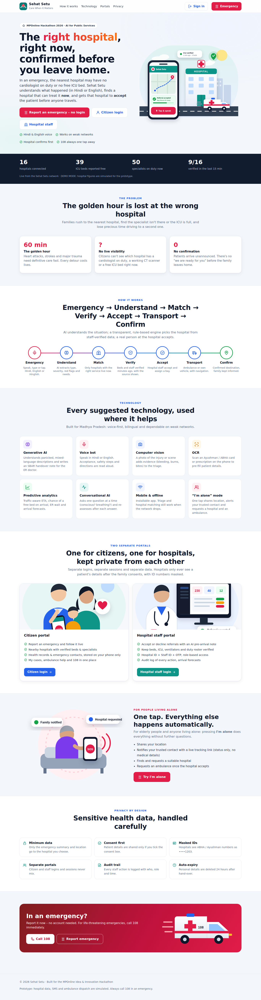
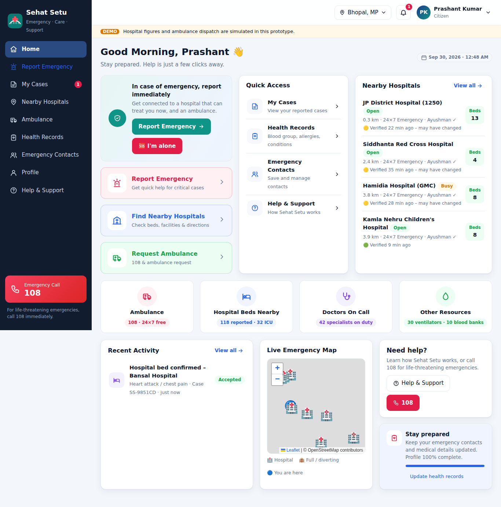
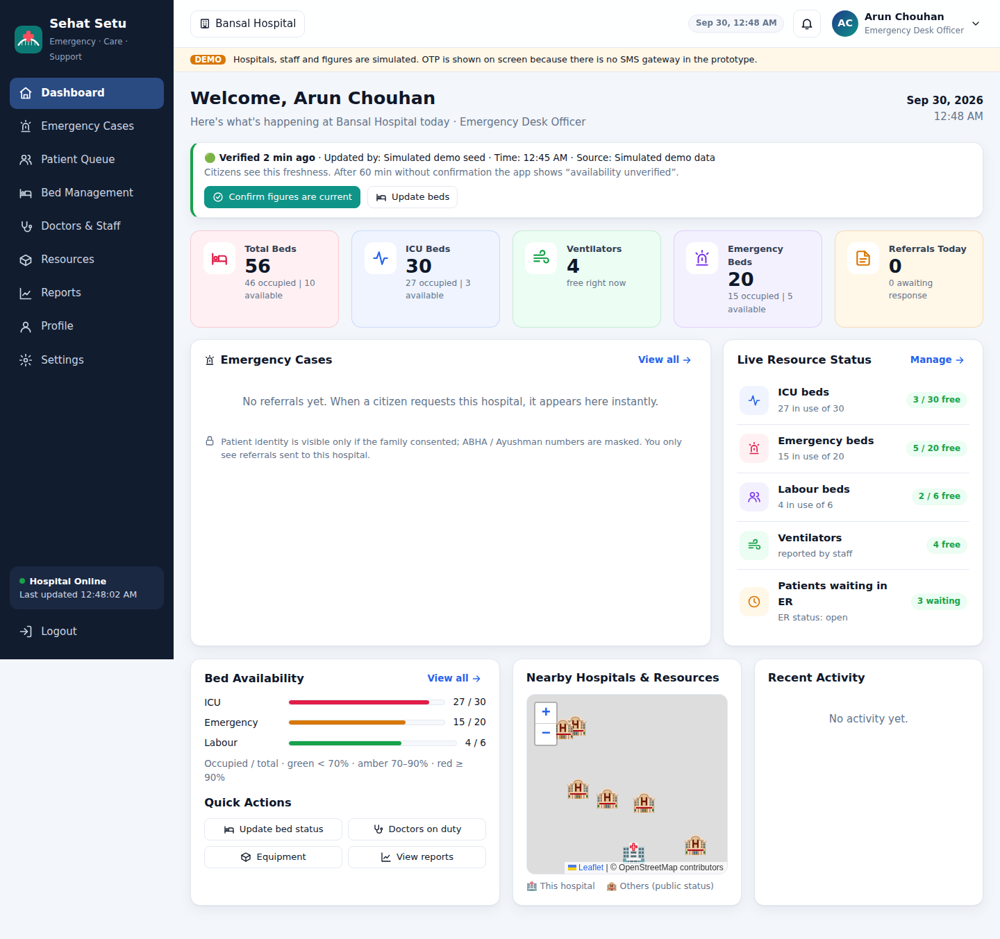
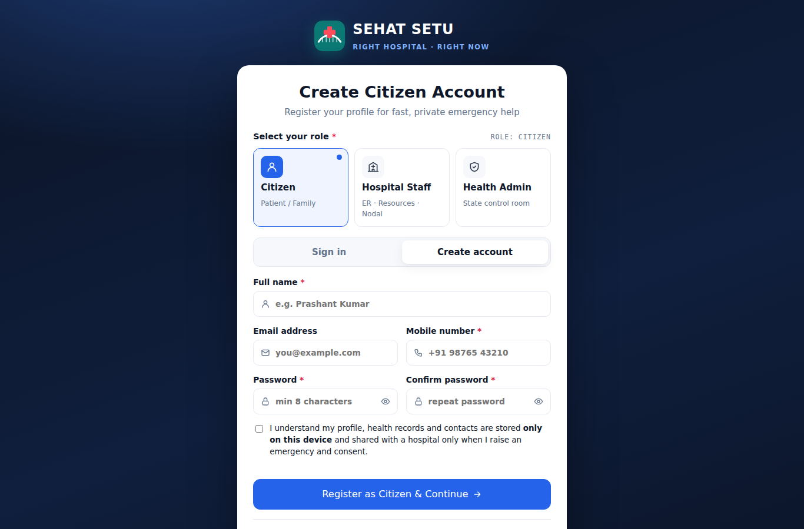
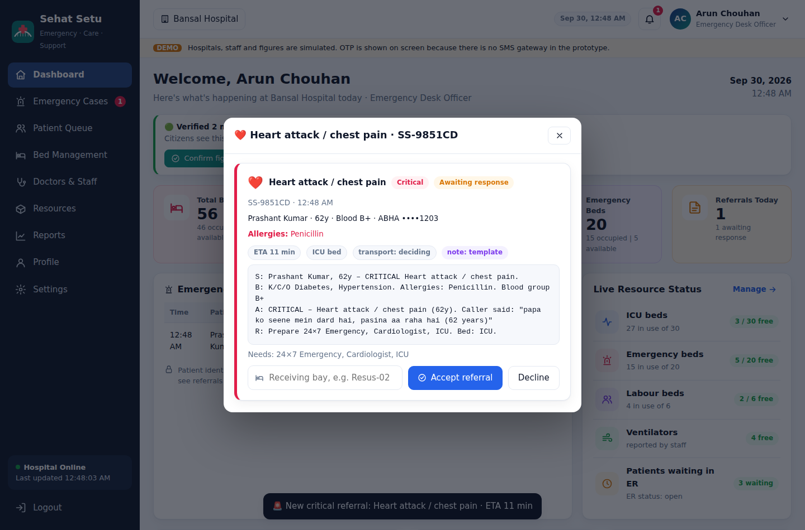
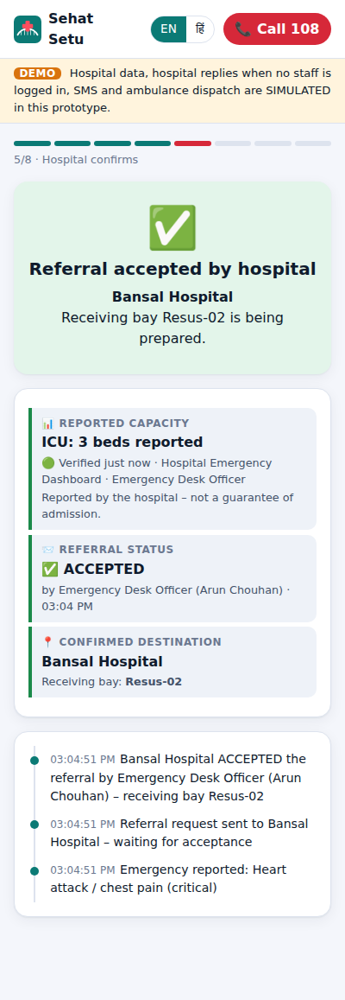
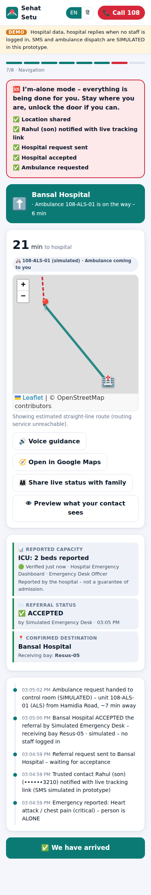

# 🚑 Medreach

**Challenge 5 · AI Innovation for Public Services & Citizen-Centric Governance · Domain: Healthcare**
MPOnline Idea & Innovation Hackathon 2026

### 🌐 Live demo: **https://medreach-2.onrender.com**

| Open | Link |
|---|---|
| 🏠 Home page | https://medreach-2.onrender.com |
| 🔐 Sign in (citizen / hospital staff) | https://medreach-2.onrender.com/login |
| 👤 Citizen dashboard | https://medreach-2.onrender.com/citizen |
| 🏥 Hospital dashboard | https://medreach-2.onrender.com/hospital |
| 🚨 Report emergency (no login) | https://medreach-2.onrender.com/report |
| 🚑 108 practice control room | https://medreach-2.onrender.com/practice-cad |
| 📑 **Final presentation (Team Alpha, PDF)** | [submission/Medreach-Final-Presentation-Team-Alpha.pdf](submission/Medreach-Final-Presentation-Team-Alpha.pdf) |

> Free Render plan: the first visit after 15 idle minutes takes about 30–50 seconds to wake up. Open the link a minute before presenting.

> In a medical emergency, families usually rush to the *nearest* hospital, only to find there is no cardiologist on duty, the CT scanner is down, or the ICU is full. They then lose the golden hour driving to a second hospital.
>
> **Medreach is an emergency *coordination* platform, not a diagnosis app.** It gets the patient to a hospital that can treat them, and that has **accepted** them, before they leave home.

### Our USP

**Emergency → Understand → Match → Verify → Accept → Transport → Confirm**

| # | Feature | What makes it credible |
|---|---|---|
| 1 | 🤖 **AI emergency understanding** | Natural language (Hindi, English, Hinglish, voice) → structured requirements. It says *"this may indicate…"*, never *"you have…"*. |
| 2 | 🏥 **Capability-based matching** | Not the nearest hospital, but one where the service exists, the specialist is on duty **now** and the machine works **now**. |
| 3 | 📊 **Current resource status** | Beds, ICU, ER open/busy/diverting, equipment and duty roster, entered by **authorised hospital staff**. |
| 4 | ⏱️ **Freshness** | 🟢 *Verified 2 min ago* · 🟡 *Verified 28 min ago – may have changed* · 🔴 *Availability unverified*. Stale data is never shown as confirmed. |
| 5 | 📞 **Hospital acceptance** | A named staff member accepts the referral and assigns a receiving bay **before** the patient travels. |
| 6 | 🔄 **Automatic fallback** | Decline or no response → the next suitable hospital is asked automatically. |
| 7 | 🚑 **Transport + confirmed destination** | Ambulance request (simulated in the prototype) or own vehicle → navigation → confirmed hospital. |
| 8 | 🔁 **Auto re-route** | If the accepting hospital loses the bed (e.g. a critical walk-in took the ICU bed), staff press *Bed no longer available*: the bed is released, the next capable hospital is asked automatically and the **same ambulance is redirected** the moment one accepts. |

---

## ▶️ See it instantly: one HTML file

Download **[`demo/medreach-prototype.html`](demo/medreach-prototype.html)** and double-click it. There's no install and no server.
You get the citizen app in a phone frame next to the hospital console.
- Keep **"I'll act as the hospital desk"** ticked: the console logs in as the receiving hospital's Emergency Desk Officer (real OTP flow, demo OTP), and you accept the referral yourself.
- Untick it: the ER desk is simulated.

It runs the same app, API, auth and store code as the full server version, just inside the page.

## Run the full version

```bash
npm install
npm start            # http://localhost:3000
npm test             # 51 tests
npm run build:demo   # regenerate the single-file demo
```

| Page | URL | Who | Login |
|---|---|---|---|
| Home page | `/` | Everyone | – |
| Report emergency | `/report` | Anyone in an emergency | **None needed** (signed-in citizens get their details pre-filled) |
| Sign in / register | `/login` | Citizen · Hospital Staff · Health Admin | Role cards, like a portal account screen |
| Citizen dashboard | `/citizen` | Patients & families | Citizen account (**Aadhaar + OTP**). **Report Emergency** opens the voice emergency app *inside* the dashboard (`/citizen#emergency`) |
| Hospital dashboard | `/hospital` | Authorised hospital staff | Hospital ID + Staff ID + OTP |

### Two separate portals, private from each other
- **Citizen portal:** sign-in and registration are **Aadhaar + OTP** sent to the Aadhaar-linked mobile, so one real person has one account and fake accounts can't be created (see below). Health records, emergency contacts and the case list are stored **only on the citizen's device**. The server never holds a citizen profile. Cases are followed through the read-only tracking token (status, hospital and ETA only).
- **Hospital portal:** the server-issued staff session is kept **per browser tab** (sessionStorage) and is bound to one hospital. Roles are enforced by the server, and every action is audit-logged.
- **Neither portal can see into the other.** Opening `/citizen` without a citizen login redirects to sign-in, and opening `/hospital` without a staff session shows the staff sign-in gate. Staff see a patient's identity only if the family consented when raising the emergency, with IDs masked, and only for referrals sent to their hospital.
- Staff accounts can't be self-registered, so nobody can pose as a hospital.

### 🗺️ Live emergency maps
Every dashboard page that deals with a place has a **LIVE** map. Markers move and change colour in place as updates stream in (SSE), without redrawing the map.

| Where | What it shows live |
|---|---|
| Citizen · Home, Nearby Hospitals | You, hospitals coloured by ER status (open / busy / full) with free ICU beds, and your active case |
| Citizen · My Cases, Ambulance | Pick-up point, accepting hospital and the **ambulance moving** along its route |
| Hospital · Dashboard, Emergency Cases, Patient Queue | This hospital, nearby hospitals' public status, incoming patients and their ambulance or own vehicle with live ETA |
| Hospital · case details | The patient's pick-up point and vehicle for that one case |

- The citizen map shows the real ambulance position only in the browser tab that raised the case. The case token is handed over in that tab's `sessionStorage` and is never saved to `localStorage`. On other devices the position is estimated from the ETA and labelled "estimated position".
- Pick-up points reach hospitals rounded to about 100 m.
- **Real roads.** The server asks the public OSRM router (OpenStreetMap data, no key) for the road route once per trip. The ambulance then drives **along that road** from its base to the patient and on to the hospital, and **your own vehicle** drives from your live location to the hospital. Every screen (your phone, the family link, the hospital dashboard) sees the same position. With the own vehicle, the phone's real GPS takes over as soon as you actually start moving. If routing is unreachable, a straight line is used and clearly labelled.
- **The map needs no API key.** Tiles are free public OpenStreetMap tiles; no key, token or account is used anywhere in the map code. The server sends `Referrer-Policy: no-referrer`, so each tile request sets its own referrer policy; OpenStreetMap refuses tile requests that carry no referrer. If tiles are blocked on a network, the pins still work on a plain grid.

Optional Generative AI: `export GEMINI_API_KEY=...` (free key from [Google AI Studio](https://aistudio.google.com/apikey)) or `export ANTHROPIC_API_KEY=...` before `npm start`. Everything works without it.

### 🌾 Rural areas: works at every level of signal
| Signal | What Medreach does |
|---|---|
| **4G / 3G** | Full app: voice, AI understanding, live hospital status, acceptance before travel, 108 ambulance, live tracking. |
| **Weak 2G** | Requests give up after 8–20 s instead of hanging, and fall back to the on-phone engines. **One SMS** to the Medreach number does the whole job on the server (below). |
| **No data** | The installed app still understands the emergency, shows first aid, ranks hospitals from the last saved status, and keeps the request to send automatically. |
| **No signal** | The screen offers **108** and **112** (emergency calls go through on any operator's tower). First aid and the map already opened stay on the phone. |

**Emergency by SMS (no internet needed).** When the app can't get through, it offers *Send to Medreach by SMS*. The SMS is readable by a person and ends with a short code the server parses:
```
MEDREACH SOS: Heart attack / chest pain (CRITICAL) at 23.60123,77.40456
#MR1 cardiac C 23.60123 77.40456 - en
```
The SMS gateway posts it to `POST /api/sms/inbound`. The server then creates the case, asks the best hospitals **one after another** until one accepts, requests the **108 / 102 ambulance**, and replies by SMS at each step (received → accepted with bay and ambulance → or "call 108" if nobody can take the patient). A hand-typed SMS with coordinates also works; without a location the reply is simply "call 108". Hospitals see these cases tagged *📩 via SMS – reporter has no internet*. The home page has a **demo SMS simulator** that runs exactly this server path.

For ASHA workers and village volunteers: anyone can report for someone else with no login, in Hindi, and pregnancy cases go to **102 Janani Express**.

### 📵 Works offline
- The whole app shell, the triage rules engine and hospital matching are cached on the phone by a service worker, so the emergency is still understood and hospitals ranked (from the last saved hospital status) with **no network**.
- A request made offline is **saved on the phone** and **sent automatically** the moment the network returns. If the app is closed, it is offered again the next time it opens.
- Meanwhile the screen offers **Call 108**, an **SMS with your location** to your trusted contact (SMS works on 2G with no data) and navigation to the hospital. The map tiles you have already seen stay available offline.
- Only public data (hospital list, config) is ever cached. Patient, case and staff responses are never stored in the cache, so a shared phone doesn't leak them.

### 🔒 Security of hospital and patient data
- **Encryption at rest:** patient details, the emergency description and the contact's phone are kept **AES-256-GCM encrypted** in server memory (`server/vault.js`). They are decrypted only for an authorised view (that hospital's staff, after consent). Set `SEHAT_DATA_KEY` to keep one key; otherwise a random key is made at every start.
- **Strict headers:** Content-Security-Policy (only our own scripts + the two CDNs we use), HSTS, `X-Frame-Options`, `nosniff`, `Permissions-Policy`, `Referrer-Policy`, and `Cache-Control: no-store` on every API response.
- **Rate limits** per client on OTP, login, case creation and AI endpoints; **staff accounts lock for 15 minutes** after 10 wrong OTPs; OTPs are compared in constant time.
- **Tamper-evident audit log:** every staff login, status change and referral decision is hash-chained (SHA-256, each entry contains the previous entry's hash). Editing, deleting or reordering any entry breaks the chain; the Nodal Officer's audit page shows the live check (`GET /api/hospitals/:id/audit/verify`).
- **Hospital data integrity:** figures can only be changed by that hospital's signed-in staff, by role (beds: Resource Manager; ER status: Emergency Desk…); values are validated and bounded, and every change records who, when and before → after.
- **Sessions:** staff session tokens are kept only as SHA-256 hashes, so a memory dump holds no usable session.
- Request bodies are capped (100 KB; 8 MB only for photos).

### 🚑 National ambulance services (108 / 102 / 112)
- Medreach **hands the incident to the state 108 control room** (its Computer-Aided Dispatch system) instead of trying to run ambulances itself: pick-up location, emergency type, priority (P1 critical / P2 serious / P3), the hospital that **already accepted** and its bay, and a call-back number. No Aadhaar/ABHA numbers, and no names unless the family consented.
- **102 Janani Express** is used for pregnancy transport, **108** for everything else; **112** is shown as the fallback that works on any network.
- The family sees the **incident number** ("if you call 108, quote 108-MP-…") and the hospital sees the assigned unit, both updated live from the control room's status: *assigned → at patient → patient on board → arrived*.
- If the control room can't be reached, the case says so immediately and the family is told to **call 108 now** (never a silent failure).
- **Integration contract** (both directions HMAC-SHA256 signed, 5-minute replay window): Medreach `POST`s the incident JSON to `SEHAT_EMS_URL` and expects `{ incidentId, unit?, etaMin? }`; the control room `POST`s status updates to `/api/ems/updates`. See `server/ems.js`.
- **In this prototype** no real 108 system is connected (that needs an agreement with the state's 108 operator / NHM MP), so a **simulated control room** assigns the nearest suitable unit from a demo fleet and is labelled *simulated* everywhere.
- **Practice 108 control room** (`/practice-cad`, `server/practice-cad.js`): to show the *real* signed integration end to end, turn on a stand-in control room. Medreach then sends each incident over HTTPS to `/api/practice-cad/incidents`; the practice control room verifies the signature, auto-assigns the nearest suitable unit from its own fleet, drives it and posts signed status updates back to `/api/ems/updates`. Its dispatcher console shows a live map, the fleet and every incident; with the dispatcher key (= `SEHAT_EMS_SECRET`) a dispatcher can assign or cancel. It is labelled *Practice 108 – not the real 108* everywhere. Settings: `SEHAT_PRACTICE_CAD=on`, `SEHAT_EMS_URL=<your site>/api/practice-cad/incidents`, `SEHAT_EMS_SECRET=<long random secret>`.

### 🔁 Auto re-route (the bed is gone after acceptance)
- On an accepted patient's card the hospital desk presses **🔁 Bed no longer available – re-route** and picks a reason (*ICU bed taken by a critical walk-in*, *equipment failure*, *specialist unavailable*, *ER overloaded*, or their own). Needs the `referral.respond` permission and is written to the audit log.
- The **reserved bed is released** at once, so the public figures stay honest.
- The **server** ranks the remaining hospitals from where the patient is *now* (the ambulance's position if the patient is on board) and asks them **one after another**; hospitals that already declined or released are never asked again.
- **The ambulance never stops.** While the next hospital is being asked, it keeps coming to the patient (or holds course with the patient on board). When a hospital accepts, the ambulance is redirected: a simulated unit gets the new route and ETA; a 108 control room gets a signed `destination_change` message (`server/ems.js`), which the practice control room shows as *RE-ROUTED*.
- If nobody can take the patient, the ambulance goes to the **nearest open emergency department for stabilisation**. If even that is impossible, the family is told to **call 108**.
- **Everyone is told:** the family app shows *"Re-routing… the ambulance keeps coming"*, then the new hospital and route. SMS-only families get a *RE-ROUTED* SMS. The family link shows the history. The new hospital sees *"Re-routed from X (reason)"*. Who released the bed stays in that hospital's audit log only.

### 🚐 Ambulance fleet: 50 units, 5–6 per area
The demo fleet has **9 service areas** (Bhopal Old City / Central / South / West / East, Berasia, Sehore, Raisen, Vidisha) with **5–6 units each**, a mix of ALS, BLS and Janani Express. The home page groups them by area (nearest area first) with live *free / on a call* status. The citizen's ambulance map shows free units within 15 km. The practice control room's fleet list is grouped the same way. When the practice control room dispatches, the public status comes from **its** fleet.

### ⏰ 108-minute hospital update cycle
- Every hospital updates its **full availability every 108 minutes**: ER status and queue, ER doctors on shift, specialists on duty, ICU / emergency / labour beds, equipment working, ventilators, and **blood stock by group** (A+ … AB-).
- The **Nodal Officer appoints a Data Update Officer** (any staff member of that hospital). The officer gets the reminders and may update every field, whatever their normal role. Every appointment and update is in the audit log.
- Reminders on the dashboard (banner, bell, sound, optional desktop notification): **10 min before**, **when due** (logged), and **15 min late** → *overdue*, escalated to the Nodal Officer.
- Citizens' freshness follows the same clock: 🟢 under 15 min, 🟡 up to 108 min, 🔴 *availability unverified* once a hospital misses its update, and such hospitals rank lower.
- The home page's **Blood** tab shows units per group per blood bank (search "O-").

### 🪪 Citizen sign-in with Aadhaar + OTP
- Enter the Aadhaar number (checked with the Verhoeff check digit) and give consent → an OTP goes to the **mobile linked with that Aadhaar** (shown masked, e.g. `••••••1001`) → enter the OTP → signed in. New and returning citizens use the same flow.
- **The Aadhaar number is never stored, logged or sent back.** The server keeps only a keyed reference (HMAC-SHA256 with a server key) to recognise the same person, and the last 4 digits for display (`XXXX XXXX 1234`). The device stores that reference, the name, the masked numbers and a signed session token (30 days).
- Protection against abuse: 3 OTP tries, at most 3 OTPs per Aadhaar per 10 minutes, a 15-minute lock after 10 wrong OTPs, and per-IP rate limits.
- **Demo vs. real:** real Aadhaar OTP needs a licensed AUA/KUA connected to UIDAI through an ASA, which a hackathon prototype can't have. In demo mode a **simulated UIDAI** is used: the OTP is shown on screen and three fictional people (Aadhaar numbers starting `9999`) are offered as quick picks; any other valid number gets a made-up linked mobile. In live mode the server refuses citizen sign-in until a licensed provider is plugged into `server/citizen-auth.js`.
- Reporting an emergency **never** needs a login.

---

## ☁️ Deploy on Render

**Live now:** https://medreach-2.onrender.com (auto-deploys on every merge to `main`).

One click: **New → Blueprint** → select this repo. [`render.yaml`](render.yaml) sets the build and start commands, the health check and all environment variables. It asks for `GEMINI_API_KEY`, `ANTHROPIC_API_KEY` and `SEHAT_DATA_KEY`. All are optional; leave them empty to run without AI.

**Turn on Gemini:** get a free key at [aistudio.google.com/apikey](https://aistudio.google.com/apikey) → Render → your service → **Environment** → add `GEMINI_API_KEY` → **Save, rebuild and deploy**. The start-up log then shows `Generative AI: Gemini (gemini-2.5-flash)`. Also add `SEHAT_DATA_KEY` (any 64 hex characters, e.g. from `openssl rand -hex 32`).
Manual: **New → Web Service** with build command `npm ci`, start command `npm start`, health check `/api/config`, plus the variables in `render.yaml`. Render provides `PORT` itself.
Keep it to **one instance**, because cases and live updates are held in memory. On the free plan the service sleeps after 15 minutes idle and forgets open cases when it restarts. That's fine for a demo; open the URL a minute before presenting.

## 🟨 Demo mode vs. real deployment (what is and isn't real)

We state this plainly, in the app (yellow **DEMO** banner) and here:

| Part | In this prototype (**demo mode**) | In a real deployment (**live mode**) |
|---|---|---|
| Hospital list & locations | Real Bhopal-region hospital names; approximate coordinates | NHA Health Facility Registry (HFR) / state facility master |
| Beds, ER status, duty roster, equipment | **Simulated seed values**, labelled *"Data source: Simulated demo data"* | Entered by authorised staff on the **Hospital Emergency Dashboard**, or synced from hospital HMIS via API |
| "Verified N min ago" | Seed times vary so all 🟢/🟡/🔴 levels are visible; any staff update re-verifies | Only staff updates/confirmations verify data |
| Hospital acceptance | Real flow when staff are logged in; **simulated** desk when nobody is logged in | Always a logged-in staff member |
| Staff & OTP | Fictional staff; OTP shown on screen (no SMS gateway) | Staff registry + SMS OTP; OTP is never returned by the API (`SEHAT_DATA_MODE=live`) |
| Ambulance | **Simulated** 108/102 control room and units | Signed hand-off to the state **108 / 102 control room (CAD)** via `SEHAT_EMS_URL`; Medreach does not control 108 |
| Emergency by SMS | Demo simulator on the home page | SMS gateway → `/api/sms/inbound`, replies via `SEHAT_SMS_SEND_URL` |
| Trusted-contact SMS | Simulated (logged + WhatsApp share link) | SMS gateway |
| AI | Offline rules engine; Gemini or Claude when a key is set | Gemini or Claude (with the rules engine as floor and fallback) |

**Proving the architecture live:** log in to the console as a hospital's staff and set the ER to *Diverting*. Every citizen currently looking at hospital options sees *"Live update from hospital dashboard"*, and that hospital disappears from their list within a second. Re-open it and it comes back, now showing *"🟢 Verified just now"* with *"Updated by: Emergency Desk Officer"*.

---

## 🎤 Judge Q&A: honest, short answers

**"Where exactly is the AI?"**
AI/NLP turns the citizen's words into structured requirements: emergency type, severity, red flags, age group and required capabilities. Then a **deterministic matching engine** applies those requirements to staff-verified facility data. *"AI understands the citizen's description; the final hospital selection is constrained by explicit healthcare requirements and verified facility data."* The AI never picks the hospital. The app shows this pipeline under **"How was this decided?"**.
- With an API key, Gemini or Claude does the understanding (`server/llm.js`) and can only **raise** urgency, never lower it (severity = max of AI and rules).
- Without a key, or offline, the rules engine (`shared/triage.js`) is the floor.

**"Are these real-time hospital beds?"**
**No, not in the prototype.** The figures are simulated and labelled so. What's real is the architecture: authorised staff update the dashboard, every figure carries *who / when / source*, freshness is enforced, and a change reaches citizens instantly. See the table above for the live-deployment data sources.

**"Where does hospital information come from?"**
Every hospital card shows *Data source* (Hospital Emergency Dashboard or Simulated demo data), *Last verified* and *Updated by* (role).

**"What does 'Match score 92' mean?"**
Each card first shows a **"Why this hospital?"** checklist (required capability ✅, ER open ✅, ICU capacity reported ✅, recently verified ✅, referral status ⏳, ETA 🚑). The score comes second, and tapping it shows its parts:
- time to care (travel + ER wait)
- bed likely free on arrival × data freshness
- extra helpful services
- facility level

The parts always add up to the total (this is tested).

**"2 ICU beds available: so the patient is admitted?"**
No. The app keeps three things separate:
- **📊 Reported capacity:** what the hospital last reported, with time and source. *"Not a guarantee of admission."*
- **📨 Referral status:** PENDING → ACCEPTED by *Emergency Desk Officer (name)* at *time*.
- **📍 Confirmed destination:** only after acceptance, with the **receiving bay** (e.g. Resus-02).

**"Does your app dispatch 108?"**
No. *"In the prototype, ambulance dispatch is simulated. In deployment, the transport layer would integrate with the authorised emergency/ambulance service rather than independently claiming control over 108."* The app always offers **Call 108 directly**.

**"Who can change what citizens see?"**
Only logged-in hospital staff: **Hospital ID + Staff ID + OTP**. Sessions are bound to one hospital, and permissions depend on role. Every login, change, referral decision and denied attempt goes into the **audit log**.

| Role | Can do |
|---|---|
| Hospital Nodal Officer | Everything for their hospital + audit log |
| Emergency Desk Officer | Accept/decline referrals, ER open/busy/diverting, confirm figures |
| Resource Manager | Beds, specialists on duty, equipment, confirm figures |
| State Health Admin | Read-only view of all hospitals + audit logs |

**"Isn't giving first aid medical advice risky?"**
It's secondary and framed as *"Safety steps while help is arranged – standard first-aid guidance, not medical advice"*, collapsed by default. The exception is CPR, which opens when someone is "not breathing". The product is **emergency coordination**, and every AI screen says *"This is not a diagnosis. Doctors decide treatment."*

**"What about someone living alone?"**
**🆘 I'm alone mode:** one tap does all five steps automatically, with a live checklist:
1. Location shared
2. Trusted contact notified with a tracking link
3. Hospital request sent
4. Hospital accepted
5. Ambulance requested

The trusted contact's link shows status, hospital and ETA, with **no medical details**.

**"Privacy?"** See [docs/PRIVACY-SECURITY.md](docs/PRIVACY-SECURITY.md). In short:
- minimum data, with explicit consent before patient details are shared
- health cards are read on the phone
- ID numbers are masked
- only the referred hospital can access the case
- family view has no medical data
- audit trail on every action
- automatic deletion 24 h after hand-over

---

## The flow (our flowchart, implemented step by step)

```
PERSON / FAMILY                                           (or 🆘 I'M ALONE → all steps automatic)
      │
🚨 SUDDEN EMERGENCY ─────────── speak (Hindi/English/Hinglish) · type · quick-pick · 📷 photo · 🪪 scan health card
      │
🧠 AI UNDERSTANDS ──────────── extracts type, severity, red flags, age group, REQUIRED CAPABILITIES
      │                          ("may indicate…", not a diagnosis) · one follow-up question at a time
📍 GET USER LOCATION ────────── GPS starts at app launch, tap map to correct
      │
🏥 FIND SUITABLE HOSPITALS      ← deterministic engine, no AI
   ┌──┴───────────────┐
Capability available?  Current status?
(service exists AND    (ER open/busy/diverting, beds REPORTED,
 specialist on duty AND  🟢🟡🔴 freshness, predicted bed on arrival,
 machine working)        ER wait, data source)
   └──┬───────────────┘
⏱️ DISTANCE + ETA ───────────── traffic-aware ETA for this hour of day
      │
📋 SHOW OPTIONS ─────────────── "Why this hospital?" checklist + explained score + "why others were excluded"
      │                          + golden-hour "stabilise first" option · 🔒 consent before sharing details
🏥 HOSPITAL CONFIRMS ────────── authorised staff accept + assign receiving bay (AI SBAR pre-arrival note)
      │                          declined / no answer → next hospital automatically
🚑 TRANSPORT ────────────────── ambulance request (simulated → 108 control room in deployment) or own vehicle
      │
🗺️ NAVIGATION ───────────────── route, turn-by-turn, voice, live tracking, family tracking link
      │
🏥 CONFIRMED HOSPITAL ───────── reported capacity ≠ referral accepted ≠ confirmed destination
```

**Home page**


**Citizen dashboard**


**Hospital dashboard**


| Sign in (role cards) | Referral review (staff) | Emergency flow: referral accepted | I'm alone |
|---|---|---|---|
|  |  |  |  |

## Every suggested technology, where it is used

| Technology | How Medreach uses it | Code |
|---|---|---|
| **Generative AI** | Gemini or Claude extracts requirements from messy multilingual descriptions and drafts an **SBAR pre-arrival handover note** for the ER doctor. | `server/llm.js` |
| **Voice Bots** | Speak the emergency in Hindi or English. Acceptance, safety steps and directions are read aloud, and the console announces new referrals. | `public/js/voice.js` |
| **Computer Vision** | Photo of the wound or scene → Gemini or Claude vision describes visible findings. Offline: on-device pixel check for blood or burns. The photo is never uploaded when offline. | `server/llm.js`, `public/js/vision.js` |
| **OCR** | Scan an Ayushman / ABHA card or prescription **on the phone** (Tesseract.js). Details are shared only with consent, and IDs are masked for hospitals. | `public/js/ocr.js`, `shared/ocr-parse.js` |
| **Predictive Analytics** | Traffic-aware ETA, Poisson **bed-on-arrival** probability (weighted by freshness), ER wait, 8-hour arrival forecast for staffing. | `shared/predict.js` |
| **Conversational AI** | One follow-up question at a time; severity and guidance update after each answer. | `shared/triage.js` |
| **Mobile Applications** | Installable PWA, Hindi/English, offline mode (triage and matching run on the phone). | `public/`, `public/sw.js` |

## Architecture

```
Citizen PWA ─┐                         ┌─ server/api.js   one set of routes & rules (also used by the demo file)
Family link ─┼── REST + SSE (HTTPS) ───┤  server/auth.js  Hospital ID + Staff ID + OTP, sessions, RBAC
Hospital     │                         │  server/store.js cases, audit log, freshness stamps, consent,
console ─────┘                         │                  masked views, retention purge, simulations
                                       │  server/llm.js   Gemini or Claude (optional)
                                       │  server/routing.js road routes (OSRM / OpenStreetMap)
                                       └─ server/vault.js AES-256-GCM encryption · server/security.js headers + rate limits
shared/ (runs on server AND phone): triage · matching · predict · freshness · roles · capabilities · ocr-parse · handover
```

| Endpoint | Who | Purpose |
|---|---|---|
| `POST /api/triage` · `/api/vision` | citizen | AI understanding → requirements |
| `POST /api/match` | citizen | Deterministic ranking + checklist + score breakdown |
| `POST /api/cases` | citizen | Create case → returns case token + family track token (once) |
| `POST /api/cases/:id/request` · `/transport` · `/arrived` | citizen (`X-Case-Token`) | Referral, transport, arrival |
| `GET /api/track/:id?t=` | trusted contact | Status only, no medical data |
| `POST /api/citizen/otp` · `/api/citizen/verify` · `GET /api/citizen/me` | citizen | Aadhaar + OTP sign-in |
| `GET /api/ambulances` | anyone | Public fleet status (unit, type, area, home station, free / on a call) |
| `POST /api/ems/updates` | 108 control room (signed) | Incident status: unit, position, at patient, arrived |
| `POST /api/sms/inbound` · `/api/sms/demo` | SMS gateway (signed) · demo | Emergency by SMS |
| `GET /api/hospitals/:id/staff` · `PUT …/update-officer` | staff · Nodal Officer | Appoint the Data Update Officer |
| `POST /api/auth/otp` · `/api/auth/verify` · `/api/auth/logout` | staff | Login |
| `POST /api/hospitals/:id/cases/:caseId/respond` | staff (`referral.respond`) | Accept/decline + receiving bay |
| `POST /api/hospitals/:id/cases/:caseId/release` | staff (`referral.respond`) | Bed no longer available → release the bed and **auto re-route** |
| `PATCH /api/hospitals/:id/status` | staff (role-dependent) | Update or confirm figures → re-verifies |
| `GET /api/hospitals/:id/audit` · `/audit/verify` | Nodal Officer / Admin | Audit log and its hash-chain check |
| `GET /api/stream/...` | per token | Live updates (SSE) |

| Env var | Default | Meaning |
|---|---|---|
| `PORT` | `3000` | HTTP port |
| `SEHAT_DATA_MODE` | `demo` | `live` = never return OTP, no demo staff list |
| `GEMINI_API_KEY` | – | Enables Gemini ([free key](https://aistudio.google.com/apikey)) |
| `GEMINI_MODEL` | `gemini-2.5-flash` | Gemini model |
| `ANTHROPIC_API_KEY` | – | Enables Claude |
| `SEHAT_AI_PROVIDER` | auto | `gemini` or `claude` when both keys are set |
| `SEHAT_DATA_KEY` | random per start | 64 hex chars; AES-256-GCM key for patient data |
| `SEHAT_ROUTING` | `on` | `off` = straight-line routes |
| `SEHAT_SIMULATE_VEHICLE` | `1` | Simulate own-vehicle drive until GPS shows movement |
| `SEHAT_EMS_URL` · `SEHAT_EMS_SECRET` | – | Real 108/102 control room endpoint and shared signing secret (simulated without them) |
| `SEHAT_PRACTICE_CAD` | off | `on` = run the practice 108 control room on this server (point `SEHAT_EMS_URL` at `/api/practice-cad/incidents`) |
| `SEHAT_SMS_NUMBER` | – | Number citizens SMS when offline (shows the *Send by SMS* button) |
| `SEHAT_SMS_SECRET` | – | Authenticates the SMS gateway on `/api/sms/inbound` |
| `SEHAT_SMS_SEND_URL` · `SEHAT_SMS_SEND_TOKEN` | – | Outbound SMS (replies, accepted, ambulance); simulated without them |
| `SEHAT_PUBLIC_URL` | Render URL | Base URL for tracking links sent by SMS |
| `SEHAT_RETENTION_MS` | 24 h | Delete personal/health details this long after hand-over |
| `SEHAT_RESPONSE_TIMEOUT_MS` | `60000` | Auto-escalate if logged-in staff don't respond |
| `SEHAT_SIM_RESPONSE_MS` | `3500` | Simulated desk delay (only when no staff logged in) |
| `SEHAT_DEMO_SPEED` | `15` | Ambulance simulation speed |

## 3-minute demo script

0. Open the **home page** (`/`). Show the live network stats, the 7-step flow and the two separate portals. Then **Login / Register** on the phone: pick the demo Aadhaar *Ramesh Kumar*, tick consent, enter the OTP shown.
1. **Hospital dashboard:** `/login` → **Hospital Staff** → *Bansal Hospital → BANSAL-ED01 → OTP* (shown on screen in demo). Point at the KPI tiles, *"Updated by / Time / Data source"* and the **DEMO** banner.
2. **Phone:** say *"Papa ko seene mein dard hai, pasina aa raha hai, 62 saal"*. The app shows *"may indicate: Heart attack · CRITICAL · needs cardiologist + ICU"*. Open **How was this decided?**: AI → requirements → deterministic engine.
3. **Find hospitals.** Walk through one **Why this hospital?** checklist, the 🟢/🟡/🔴 freshness badges (Siddhanta 🟡, People's 🔴 excluded anyway: cardiologist off duty), and point at **% bed free on arrival** on each card (the Poisson prediction; the match score is under *Match score → what does it mean?*)
4. **Console:** set ER to **Diverting**. The phone shows a live update and Bansal disappears. Set it back to **Open**: Bansal returns as *"Verified just now"*.
5. **Ask hospital to accept.** The console beeps and shows the SBAR note, with IDs masked and no details without consent. Enter bay *Resus-02* and **Accept referral**. The phone shows **Reported capacity → ACCEPTED by Emergency Desk Officer (name) → Confirmed destination, bay Resus-02**.
6. **Request ambulance.** Note the *simulated* label and "Call 108 directly". Open **Preview what your contact sees**: status only, no medical details.
6b. **Auto re-route.** On the console open **Emergency Cases → Accepted & on the way**, press **🔁 Bed no longer available – re-route** and choose *ICU bed taken by a critical walk-in patient*. The phone shows *Re-routing… the ambulance keeps coming*, and a few seconds later the new hospital, route and ETA. The ambulance is the same unit, now redirected.
7. Log in as **BANSAL-NO01** (Nodal Officer) to show the **audit log**. On the phone, open the **citizen dashboard → My Cases**: the case shows *Accepted*, and the recent activity is updated.
8. New tab → save a trusted contact → **🆘 I'm alone**. All five steps complete by themselves.

## Limitations & roadmap
- Integrate the NHA Health Facility Registry, hospital HMIS feeds and the 108 CAD system (live mode).
- ABHA consent-based record fetch (ABDM) instead of OCR-only.
- IVR / missed-call channel for feature phones; SMS gateway for OTP and trusted-contact alerts.
- Persistent encrypted database, key management and a formal DPDP Act 2023 impact assessment.
- Clinical validation of the triage rules with emergency physicians.

> ⚠️ Medreach is a prototype and does not replace medical advice. In an emergency, always call **108**.
