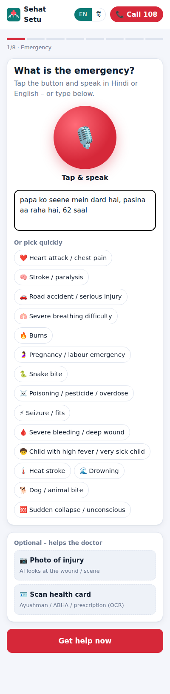
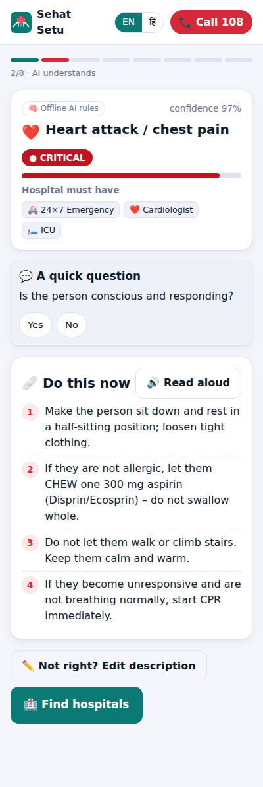
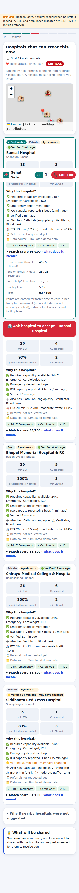
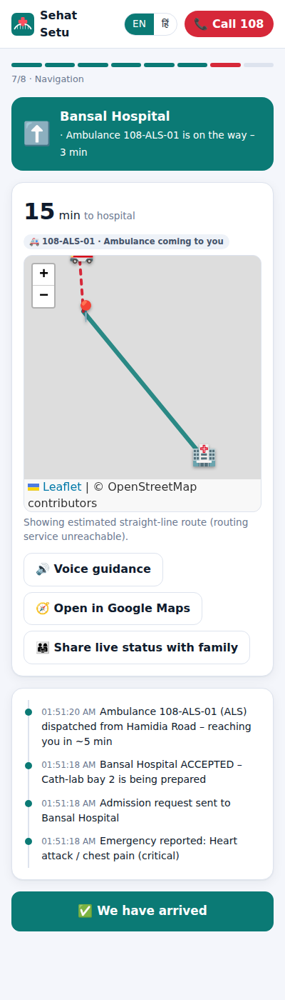
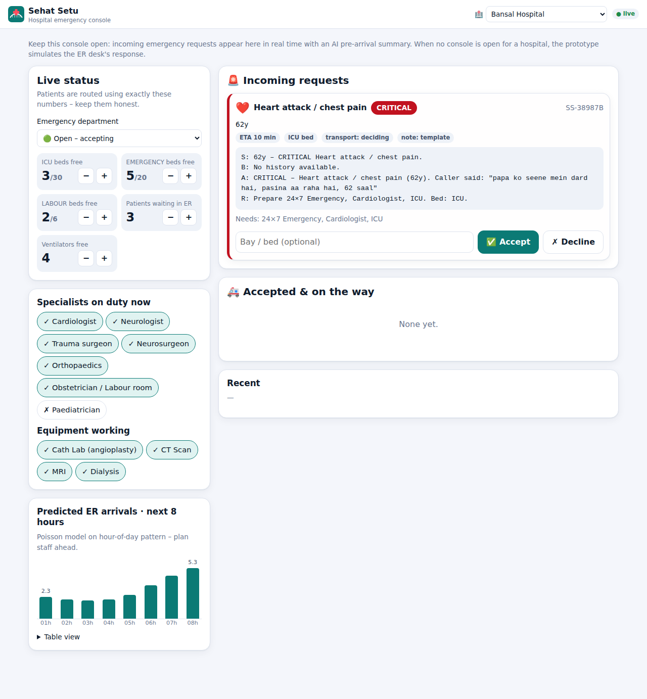

# 🚑 Sehat Setu – सेहत सेतु

**Challenge 5 · AI Innovation for Public Services & Citizen-Centric Governance · Domain: Healthcare**
MPOnline Idea & Innovation Hackathon 2026

> In a medical emergency, families in Madhya Pradesh usually rush to the *nearest* hospital, only to find there is no cardiologist on duty, the CT scanner is down, or the ICU is full, and they lose the golden hour driving to a second hospital.
> **Sehat Setu ("health bridge") gets the patient to the *right* hospital the first time.** It understands the emergency (voice, Hindi or English), finds hospitals that can treat it *right now*, gets the hospital to confirm before you leave, and guides you there by ambulance or your own vehicle.

---

## The flow (our flowchart, implemented step by step)

```
PERSON / FAMILY
      │
🚨 SUDDEN EMERGENCY ─────────── speak (Hindi/English/Hinglish) · type · quick-pick · 📷 photo · 🪪 scan health card
      │
🧠 AI UNDERSTANDS ──────────── type, severity, danger signs, what the hospital must have,
      │                          first aid read aloud, one follow-up question at a time
📍 GET USER LOCATION ────────── GPS starts at app launch (saves seconds), tap map to correct
      │
🏥 FIND SUITABLE HOSPITALS
   ┌──┴───────────────┐
Capability available?  Current status?
(has the service AND   (ER open/busy/diverting,
 specialist on duty AND  beds free now, predicted
 machine working)        bed on arrival, ER wait)
   └──┬───────────────┘
⏱️ DISTANCE + ETA ───────────── traffic-aware ETA for this hour of day
      │
📋 SHOW OPTIONS ─────────────── ranked, with "why this hospital" + "why others were excluded"
      │                          + golden-hour "stabilise first" option for far-away critical cases
🏥 HOSPITAL CONFIRMS ────────── real-time alert + AI pre-arrival SBAR note on the hospital console;
      │                          declined / no answer → auto-escalates to the next best hospital
🚑 TRANSPORT ────────────────── 108 ambulance (ALS / BLS / Janani Express) or own vehicle, with a recommendation
      │
🗺️ NAVIGATION ───────────────── road route, turn-by-turn, voice guidance, live ambulance tracking,
      │                          Google Maps hand-off, share status with family on WhatsApp
🏥 CONFIRMED HOSPITAL ───────── bed/bay reserved, handover complete
```

Each box is one screen of the citizen app (`public/js/app.js`, steps 0 to 7).

| Emergency | AI understands | Suitable hospitals | Navigation |
|---|---|---|---|
|  |  |  |  |

**Hospital console:** the ER desk gets the AI pre-arrival note and accepts in one tap.


## Every suggested technology, where it is used

| Technology (from the problem statement) | How Sehat Setu uses it | Code |
|---|---|---|
| **Generative AI** | Claude understands messy, multilingual descriptions, writes first aid in the caller's language, and drafts an **SBAR pre-arrival handover note** for the ER doctor. | `server/llm.js` |
| **Voice Bots** | Speak the emergency in Hindi or English (speech-to-text). First aid, hospital acceptance and turn-by-turn directions are **read aloud** (text-to-speech). The hospital console announces new patients. | `public/js/voice.js` |
| **Computer Vision** | Photo of the wound or scene → Claude vision describes visible findings (bleeding, burns, bite marks, pesticide bottle). Offline, an **on-device pixel analysis** estimates visible blood or burns. | `server/llm.js` `aiVision`, `public/js/vision.js` |
| **OCR** | Scan an **Ayushman Bharat / ABHA card, prescription or discharge summary** (Tesseract.js, English + Hindi, runs on the phone) → name, age, blood group, ABHA ID, conditions, allergies and medicines are pre-filled and sent to the hospital. | `public/js/ocr.js`, `shared/ocr-parse.js` |
| **Predictive Analytics** | Explainable models: **traffic-aware ETA** by hour of day, **Poisson model of bed availability on arrival**, **ER wait prediction**, and an **8-hour ER arrival forecast** for hospital staffing. | `shared/predict.js` |
| **Conversational AI** | Asks **one follow-up question at a time** (conscious? breathing? age? bleeding?) and re-assesses after each answer. Severity and first aid update live (e.g. "not breathing" → CPR first). | `shared/triage.js` `FOLLOW_UPS` |
| **Mobile Applications** | Installable **PWA**, mobile-first, works on low-end Android, Hindi/English UI, **offline mode** (service worker, and the triage and matching engines run in the browser). | `public/manifest.webmanifest`, `public/sw.js` |

## Why it's built this way

- **The AI can raise urgency, never lower it.** Severity = max(rules, Claude), and required capabilities are the union of both. A model mistake can't send a heart attack to a clinic.
- **It never blocks on the AI.** If Claude is slow, rate-limited or not configured, the offline rule engine (English + Hindi + Hinglish keywords, red flags, age modifiers) answers immediately. The app is fully usable without an API key.
- **The same brain runs on the server and the phone.** `shared/*.js` are plain ES modules used by both, so with no internet the phone still understands the emergency and ranks hospitals from the last saved status.
- **"Capability" means *live* capability.** A hospital with a cath lab whose cardiologist is off duty, or whose CT scanner is down, is *not* offered for a heart attack or stroke, and the app shows *why*.
- **Explainable ranking.** Every option shows ETA, distance, bed-on-arrival probability, ER wait and the reasons behind its score. Excluded hospitals are listed with reasons too.
- **Golden-hour safety net.** If the best capable hospital is far away and the patient is critical, the app suggests the nearest emergency department to stabilise first.
- **Built for MP.** Hindi first, 108 always one tap away, Ayushman Bharat filter, Janani Express for pregnancy, rural CHCs and district hospitals in the registry, advice against jhaad-phoonk for snake bites, pesticide-poisoning guidance for farm emergencies.

## Architecture

```
┌──────────────────────────┐        REST + Server-Sent Events        ┌─────────────────────────────┐
│ Citizen PWA (index.html) │ ◄─────────────────────────────────────► │  Node.js + Express server    │
│  voice · camera · OCR    │                                          │  server/index.js  (API)      │
│  Leaflet map · offline   │                                          │  server/store.js  (cases,    │
└──────────────────────────┘                                          │    SSE hub, ambulance sim)   │
┌──────────────────────────┐                                          │  server/llm.js    (Claude)   │
│ Hospital console         │ ◄─────────────────────────────────────► │  server/data/     (registry) │
│  (hospital.html)         │   accept/decline · live bed & duty status└──────────────┬──────────────┘
└──────────────────────────┘                                                         │
              ▲                   shared/ (runs on server AND phone)                  │
              └──────── triage.js · matching.js · predict.js · capabilities.js · ocr-parse.js
```

| Endpoint | Purpose |
|---|---|
| `POST /api/triage` | Emergency understanding (rules + Claude) |
| `POST /api/vision` | Photo analysis (Claude vision) |
| `POST /api/match` | Capability + status → ETA → ranked hospitals |
| `POST /api/cases` · `/:id/request` · `/:id/transport` · `/:id/arrived` | Case lifecycle |
| `POST /api/hospitals/:id/cases/:caseId/respond` | Hospital accepts / declines |
| `PATCH /api/hospitals/:id/status` | Hospital updates beds, ER status, specialists, equipment |
| `GET /api/stream/case/:id` · `/api/stream/hospital/:id` | Real-time updates (SSE) |

## See it instantly – one HTML file

Download **[`demo/sehat-setu-prototype.html`](demo/sehat-setu-prototype.html)** and double-click it. There's no install and no server.
It shows the citizen app in a phone frame next to the hospital console. Tick **"I'll act as the hospital desk"** to accept patients yourself, or untick it to let the ER desk be simulated.
It runs the same app code and engines as the full version, with the backend running inside the page (offline AI rules; maps need internet).
Rebuild it after changing code with `npm run build:demo`.

## Run it

```bash
npm install
npm start            # http://localhost:3000
```

- Citizen app: <http://localhost:3000/> (open on your phone on the same Wi-Fi via your laptop's IP)
- Hospital console: <http://localhost:3000/hospital>
- Tests: `npm test` (42 tests: triage, matching, prediction, OCR parsing, AI safety merge, full API flow)

**Enable Generative AI (optional):** set an Anthropic API key before starting. Everything else works without it.

```bash
export ANTHROPIC_API_KEY=sk-ant-...
npm start
```

| Env var | Default | Meaning |
|---|---|---|
| `PORT` | `3000` | HTTP port |
| `ANTHROPIC_API_KEY` | – | Enables Claude triage, vision and handover notes |
| `SEHAT_MODEL` | `claude-opus-5-5` | Claude model |
| `SEHAT_DEMO_SPEED` | `15` | Ambulance simulation speed (1 real second = N simulated seconds) |
| `SEHAT_SIM_RESPONSE_MS` | `3500` | Delay of the simulated ER desk when no hospital console is open |
| `SEHAT_RESPONSE_TIMEOUT_MS` | `60000` | Auto-escalate if a hospital console doesn't answer |
| `SEHAT_SIMULATE` | `1` | Set `0` to stop the random walk of bed counts |

## 3-minute demo script (for judges)

1. Open the **hospital console** on a laptop and pick *Bansal Hospital*. Open the **citizen app** on a phone.
2. On the phone tap 🎙️ and say *"Papa ko seene mein dard hai, pasina aa raha hai, 62 saal"*.
   → Heart attack · **CRITICAL** · needs cardiologist + ICU · first aid (chew aspirin) is read aloud in Hindi.
3. Answer the follow-up question → **Find hospitals**. Point out that JP Hospital (nearer) was excluded because it has no cardiologist, and that People's Hospital was excluded because the cardiologist is off duty *now*.
4. On the console, toggle **Cardiologist off** at Bansal and search again: it disappears from the options. Toggle it back on.
5. **Request admission**. The console beeps and shows the AI SBAR note. Type a bay and **Accept**. The phone confirms instantly.
6. Choose **Ambulance**: the nearest ALS 108 ambulance is dispatched and you can watch it move on the map, on both screens.
7. Switch the phone to airplane mode and report *"saanp ne kaat liya"*: it still understands the emergency and suggests anti-venom hospitals, offline.

## Prototype limitations & roadmap

- **Data is simulated.** Hospital names are real Bhopal-region landmarks, but coordinates are approximate and beds, duty rosters and equipment status are demo values. Production would integrate the **NHA Health Facility Registry**, hospital HMIS feeds and the **108 / Janani Express dispatch system (CAD)**.
- Hospital acceptance is **simulated** when no console is open for that hospital, so the demo works on one screen.
- ABHA integration (fetching records with patient consent via ABDM) instead of OCR-only.
- IVR / missed-call + SMS channel for feature phones.
- Train the predictive models on real historical 108 and hospital admission data.
- Authentication for hospital staff, audit logs, and DPDP Act-compliant data retention.

> ⚠️ Sehat Setu is a prototype and does not replace medical advice. In an emergency, always call **108**.
